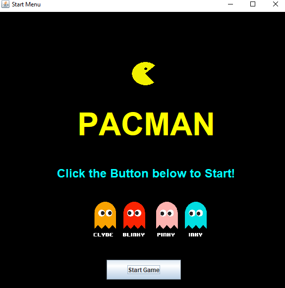
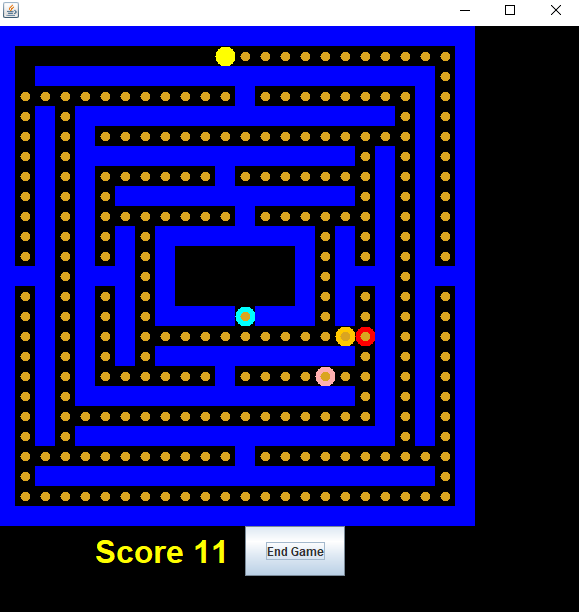

# Pacman Game

## Tom Dai, Jason Soo, Kane Hsu, Alexander Pastor



### Running the Game
1. Navigate to the P2 directory
2. Make sure Gradle is installed, then run:
```bash
gradle build
gradle run
```

If you are using Powershell use:
```bash
.\gradlew build
.\gradlew run
```
3. Enjoy!

## PacMan Class

### get_valid_moves

### move

### is_ghost_in_range
- **Type**: `() -> Bool`
- **Implementation**: This method scans a 3x3 grid of locations with pacman at the center. If any ghost is within the bounds of this grid, this method returns true and returns false otherwise.
- **Test Description**: Two tests were created. The first one creates a pacman at location (10,10), a ghost at location (9,9), and ensures is_ghost_in_range() returns true. The second test creates a pacman at location (1,1), a ghost at location (3,3) and makes sure is_ghost_in_range() returns false.

### consume
- **Type** `() -> JComponent`
- **Implementation**: This method will check to see if pacman is able to eat nearby cookies and will return the cookie component if so, and null otherwise. It uses the Map.getLoc method to get a hashset of components at Pacman's locations to see if there is a cookie there. If so, pacman will call the Map.eatCookie method and will return a cookie component.
- **Testing**: For Testing, I initalized a frame with pacman and a cookie at the same location. I called the consume method and checked to see if the method returned a cookie component and incremented the score in the frame's map. Then I called the consume method gain, to see if the cookie was fully removed from the map and checked to see if the method returned null a second time. Additionally I also checked to see that this second call did not increment the score. 

## Ghost Class

### get_valid_moves

### ghost-move

### is_pacman_in_range

### attack
- **Type**: `() -> Boolean` 
- **Implementation**: This method will call Ghost.is_pacman_in_range method to see if pacman is in range of the ghost, if so it will return Map.attack, and false otherwise.
- **Testing**: For Testing I initalized two frames, one with a ghost near pacman, and one that had a ghost far from pacman. I called ghost.attack for both and tested for true and false respectively.

## Map Class

### move

### getLoc

### attack

### eatCookie
- **Type**: `(String name) -> JComponent`
- **Implementation**: This method takes in a string for pacman's name and will determine if pacman is able to eat a cookie on the map. If so, it will return the cookie component, remove that cookie's location from the field, remove it from the compnents list, and remove its location from the list of locations. It will also increment the score by one. It will return null if it doesn't find a cookie at pacman's location.
- **Testing**: The testing for this method is very similar to pacman's consume in that create a frame where pacman spawns ontop of a cookie and we call the eatCookie method to check to see if he returns a component, and if the score is incremented. If we call it a second time, we also indirecly check to see if the fields are removed and we check for null once the method returns. Additionally we also check and make sure the score is not incremented as pacman is not suppose to eat a cookie on the second method call.
